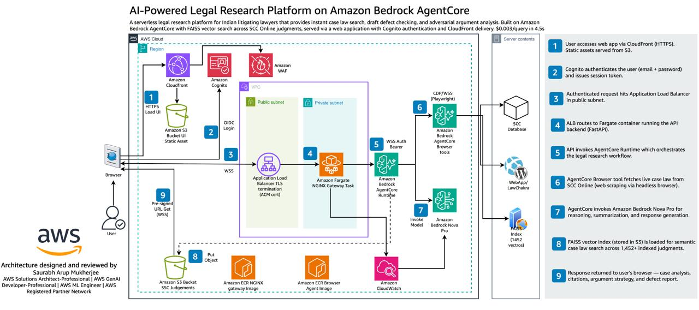

# Legal AI Bot — Indian Case Law Research on Amazon Bedrock AgentCore



## AI-Powered Legal Research Platform on Amazon Bedrock AgentCore

A serverless legal research platform for Indian litigating lawyers that provides instant case law search, draft defect checking, and adversarial argument analysis. Built on Amazon Bedrock AgentCore with FAISS vector search across SCC Online judgments, served via a web application with Cognito authentication and CloudFront delivery.

**$0.003/query | 4.5s response | 1,452+ judgments indexed**

---

## Architecture Flow

| Step | Description |
|------|-------------|
| 1 | User accesses web app via CloudFront (HTTPS). Static assets served from S3. |
| 2 | Cognito authenticates the user (email + password) and issues session token. |
| 3 | Authenticated request hits Application Load Balancer with TLS termination (ACM cert) + WAF protection. |
| 4 | ALB routes to Fargate container running the NGiNX Gateway Task. |
| 5 | API invokes AgentCore Runtime which orchestrates the legal research workflow. |
| 6 | AgentCore Browser tool (Playwright, CDP/WSS) fetches live case law from SCC Online via headless browser. |
| 7 | AgentCore invokes Amazon Bedrock Nova Pro for reasoning, summarization, and response generation. |
| 8 | FAISS vector index (1,452+ vectors stored in S3) is loaded for semantic case law search. |
| 9 | Response returned to user's browser — case analysis, citations, argument strategy, and defect report. |

---

## Features

### 1. Case Law Research (FAISS Vector Search)
Query natural language legal questions → get relevant Indian court judgments with citations in ~4.5 seconds.

### 2. Filing Defect Checker
Upload a draft pleading → AI checks against 8 mandatory High Court registry requirements.

**Defects checked:** Margin alignment, typed vs handwritten, pagination, translation requirements, index vs annexure cross-check, typo errors, court fee/verification, formatting.

### 3. Devil's Advocate
Submit your legal argument → AI attacks it from opposing counsel's perspective with counter-precedents and risk rating.

---

## Security

| Layer | Implementation |
|-------|---------------|
| Application Protection | AWS WAF |
| Authentication | Amazon Cognito (OIDC) |
| Service Authorization | WSS Auth Bearer |
| Transport Encryption | TLS termination at ALB (ACM certificate) |
| Network Isolation | VPC with public + private subnets |

---

## Tech Stack

| Component | Service |
|-----------|---------|
| Frontend | CloudFront + S3 (LawChakra web app) |
| Auth | Amazon Cognito (OIDC) |
| Gateway | ALB + WAF + ACM |
| Compute | Fargate (NGiNX Gateway Task) |
| AI Runtime | Amazon Bedrock AgentCore Runtime |
| Web Scraping | AgentCore Browser (Playwright, CDP/WSS) |
| LLM | Amazon Bedrock Nova Pro |
| Embeddings | Amazon Titan Embed Text V2 |
| Vector Search | FAISS (1,452 vectors, IndexFlatIP) |
| Storage | Amazon S3 (SCC judgments, FAISS index, artifacts) |
| Container Registry | Amazon ECR (NGiNX image + Browser Agent image) |
| Monitoring | Amazon CloudWatch |

---

## Live System

- **Web App:** https://main.d1nvmh7pabkyfy.amplifyapp.com
- **AgentCore Runtime:** `legalAiAgentRuntime-mteSKGE2Ym` (us-east-1)
- **Research API:** https://3t5punay3k.execute-api.us-east-1.amazonaws.com/
- **Defect Checker API:** https://w8zn7cr8ta.execute-api.us-east-1.amazonaws.com/

---

## Key Metrics

| Metric | Value |
|--------|-------|
| Cost per query | $0.003 |
| Response latency | 4.5 seconds |
| Indexed judgments | 1,452+ (Criminal, Arbitration, Civil, Revenue) |
| Defects checked | 8 per document |
| Region | us-east-1 |

---

## Deployment

```bash
# Build and push container
python deploy.py --build

# Deploy to AgentCore
python deploy.py --deploy

# Rebuild FAISS index (after adding new judgments)
python functions/build_index.py
```

---

## Pricing Model

| Tier | Features | Price |
|------|----------|-------|
| Basic | Case law search (5 queries/day) | Free trial |
| Pro | Unlimited search + defect checker + devil's advocate | ₹2,999/month |
| Enterprise | Pro + custom templates + priority support | ₹9,999/month |

---

## Author

**Saurabh Mukherjee** — AWS Solutions Architect Professional | GenAI Professional | ML Engineer Associate

Co-founded with ADC Kaushal Sharma (practicing lawyer, 15+ years litigation experience).
